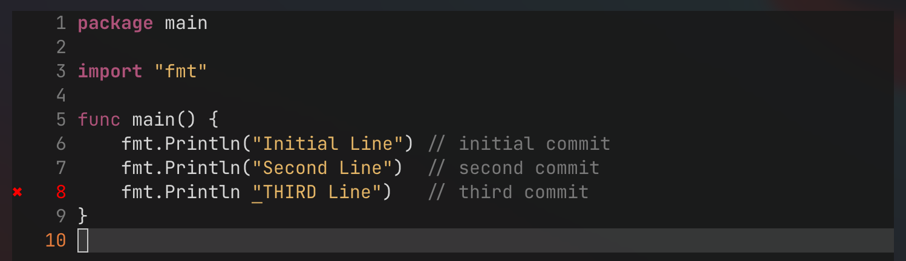
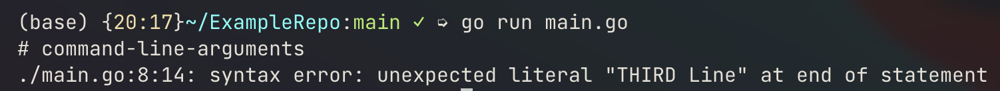
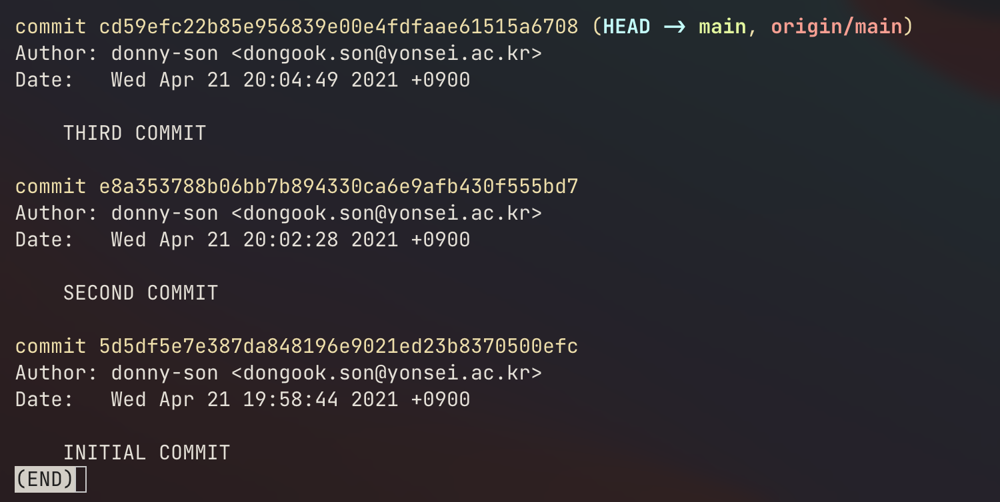
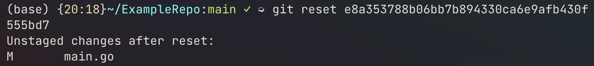
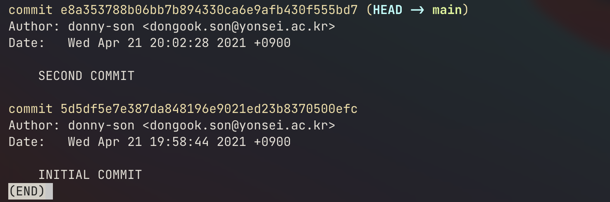
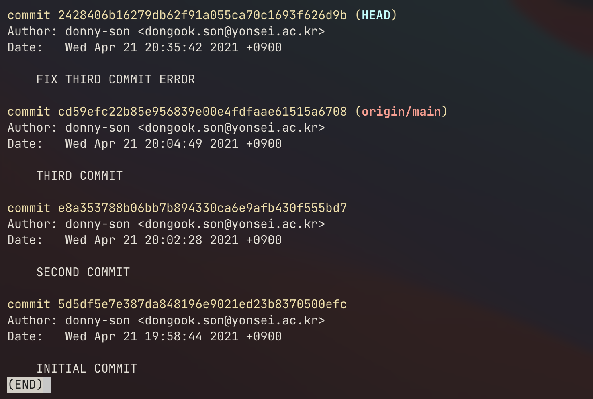
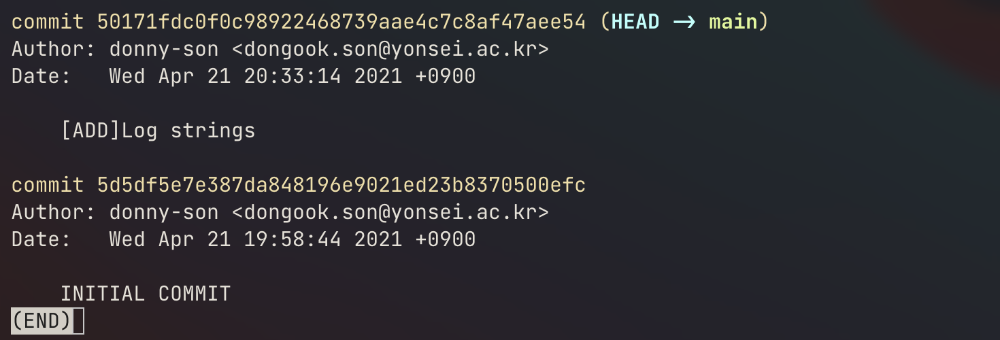
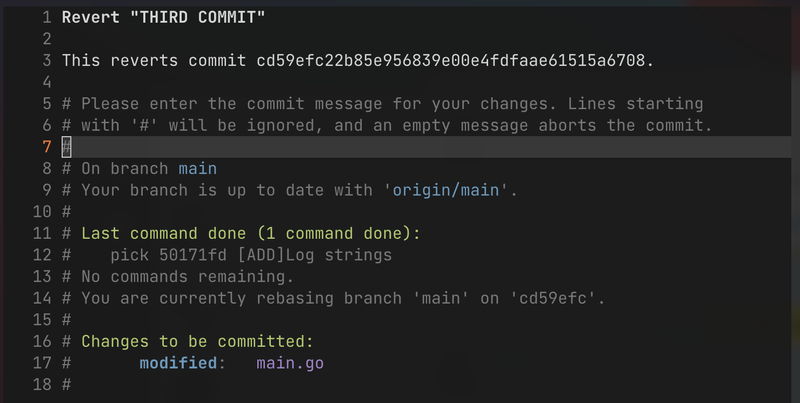
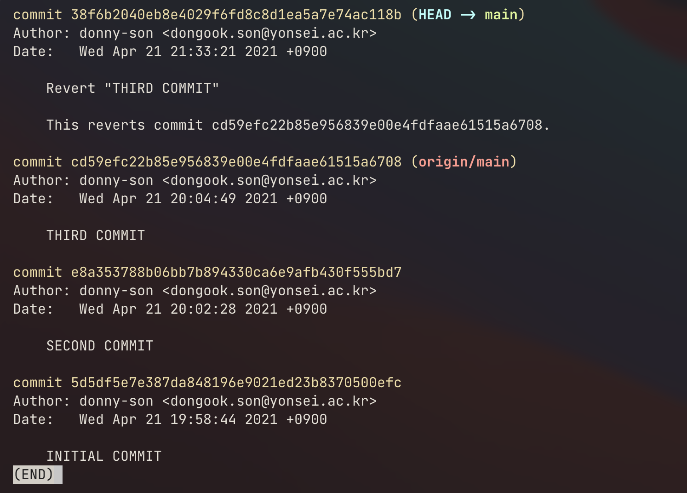
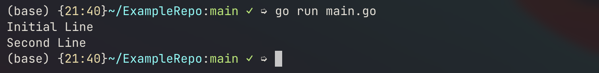

> “If you **travel** back into your own past, that destination becomes your future, and your former present becomes the past, which can't now be changed by your new future.”
>
> -Hulk from Avengers: Endgame

`Revert` and `Reset` are git commands that come in handy when you need to organize commits or delete them permanently. I will compare these commands how they differ and when they might become useful for a project.

## Initial setup

So let’s setup a repository called `ExampleRepo`. We will start with a single script `main.go`. And I’ll append new lines in this script for new commits.

```shell
ExampleRepo
└── main.go
```

```go
package main

import "fmt"

func main() {
    fmt.Println("Initial Line")
}
```

I broke the code intentionally on the third commit as shown below.





## Reset

### simple usage

Now let’s say we accidentally made the third commit and we want to get rid of this commit on our git history, since it is a disgrace and you do not want your employer or coworkers to find out about this. How can we do this?

This is where the git `reset` command comes in. The git log after the third commit will look like this. Our objective is to erase the third commit from the history and to rollback to the second commit. The reset command can be used in the following syntax.

```shell
git reset <hash of commit:WHERE YOU WANT TO BE>
```

Now, when you are doing a reset the hash of some commit you used will _become the latest commit_ and all changes you made since then will be unstaged.



So in this case, our result output is shown in the below image.



And if we do a `git log` then we have,



So we successfully got rid of our third commit and saved face.

If you’re a short-commit type of person then note that you can actually _concatenate_ several short commits into a semantically grouped commit. So from the example above, let’s say I’ve fixed the issue(the fourth commit). Since all commits are nothing but printing log texts, we can concatenate our second, third and fourth commits by reseting to the initial commit and staging changes and commiting them in the following way.

So this,



can be cleaned up by running the following command.

```shell
git reset 5d5df5e7e387da848196e9021ed23b8370500efc
git add .
git commit -m "[ADD]Log strings"
```

Then our git history will look like,



The most recent 3 commits where concatenated to the commit where the message is `[ADD]Log strings`.

### caution

However, when you have already pushed your commits to the remote repository, you would not be able to do a normal `git push` of your tidy git history. Git will just think that your local branch is behind would refer you to a `git pull`. You would need a `-f` flag, the force option, to the `push` command to force rewrite the git history of the remote repository accordingly to your local branch history.

Also note that if other teammates already made changes to your branch and created new branches of their own, as they have already cloned your accident commit, this master plan would not work since git is a distributed version control system.

The simple way of avoiding the aforementioned issue is to double check your code before the `push`.

## Revert

Now, sometimes you’re team might find a bug in production code after some merge or a direct commit to the production branch. Then, in this case, you might want to rollback to the previous commit where everything worked smoothly, check where the code broke and fix the issue. This can be done with the `revert` command. It goes back to a previous commit but keeping the history of that revert. I’m not sure this applies 100%, but Hulk in Avengers:Endgame kind of explains this really well.

> “If you **travel** back into your own past, that destination becomes your future, and your former present becomes the past, which can't now be changed by your new future.”
>
> -Hulk

This is, in essence, `git revert`. You, as a programmer, are going back in time to your previous commit, making that past commit your present commit and as a result your most recent commit will become the past commit.

Let’s go back to the previous example.


Note that our third commit had a bug and failed to run. But, in this case, let’s say that the third commit was a very important feature in our `main.go`. Then we would need to _undo_ the third commit and go over the code trying to see what broke the program. The revert command can be implemented in the following way.

```shell
git revert <hash to commit:COMMIT YOU WANT TO UNDO>
```

If I try to revert the third commit, I end up with the following prompt. This will be a commit message of my revert.



If I write and exit the message, our git log will look like the following image.



Git reverted my third commit, which means, that in my `main.go` will print two lines without any issues.



## Conclusion

In short, `reset` is setting your local HEAD to a past commit and forgetting commits after that certain point and `revert` is undoing a certain commit, but your local HEAD being at the latest commit. `reset` will make your local branch fall behind compared to the remote origin, however `revert` does not mess up your commit timeline.
