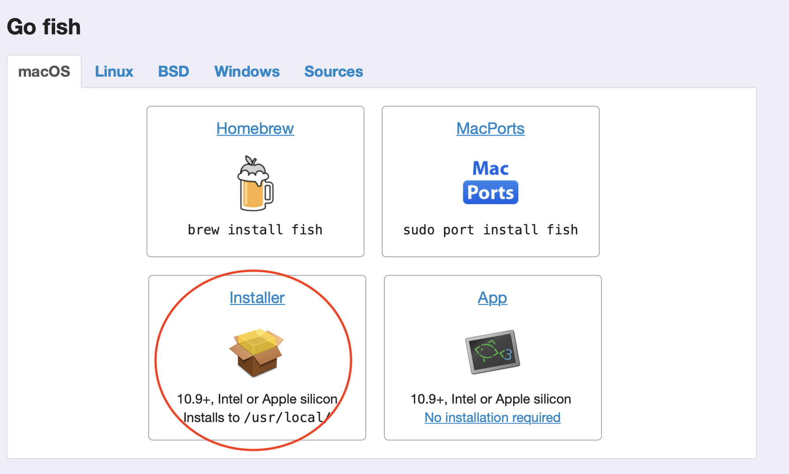
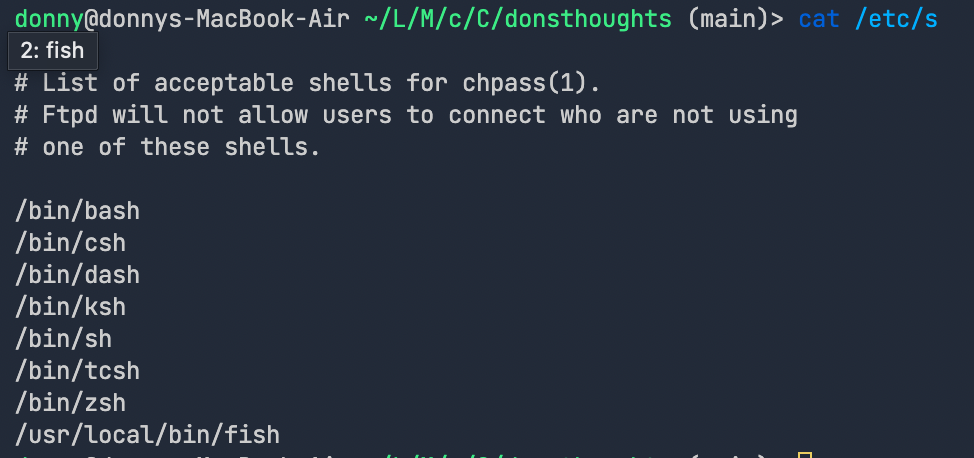

Recently I have decieded to change my default shell to [fish](https://fishshell.com). For the following reasons.

1. Z shell was getting slower due to various packages that I rarely use.

2. Wanted to keep a simple configuration file in my `./config` folder.

3. Did not want to spend time on configuration.

Well, to tell the truth, zsh was blazing fast in my M1 macbook air, but on my other intel macs the startup time took 2~3 seconds, which was apparently the amount of time that can drive you crazy.

## Troubleshooting

Since `homebrew` is natively supported on Apple Silicon architectures, I installed `fish` using, `brew install fish`. And it worked fine. However, when I added the path of the installed fish(`/opt/homebrew/fish`) to `/etc/shells` it did not work, giving me `chsh: fish: non-standard shell`.

## How to install fish to your m1 mac

1. Go to the [fish](https://fishshell.com) homepage and download the installer.
   

2. Check your `fish` path. It should be `/usr/local/bin/fish`.

```shell
which fish
```

3. Append the `fish` path to your `/etc/shells` with sudo permissions.

```shell
sudo vim /etc/shells
# then dd /usr/local/bin/fish
```

Then the file would look like this.


4. Use `chsh` command to change default shell.

```shell
chsh -s /usr/local/bin/fish
```

If you exit your current shell and restart your terminal then it would open running the fish shell.
