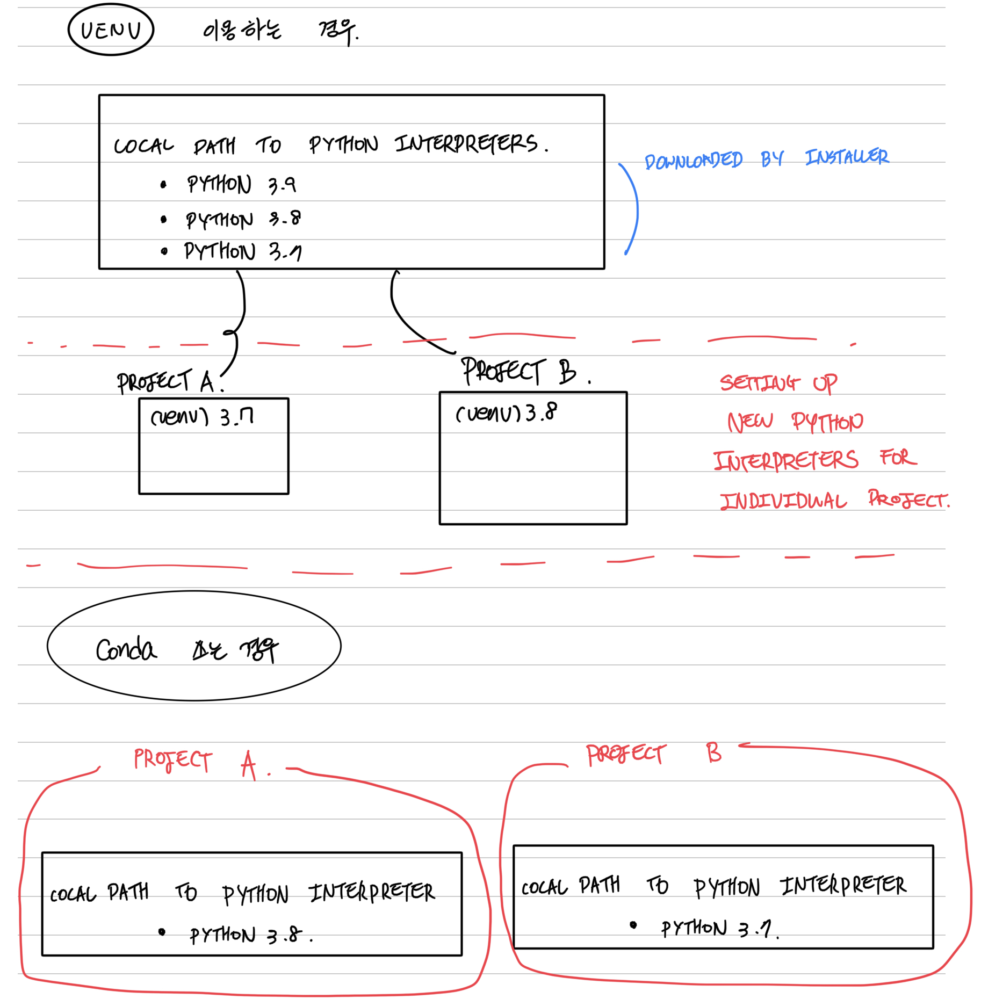

# `venv` vs `conda`

## Summary
venv : setting up individual python interpreters(fresh and new) for each project.
conda : creating and using conda environments for each individual project. 

## Personal Thoughts

### `venv`:

#### pro: 
- native python. Able to use the latest python versions 3.9, 3.10, ...
- easy to use

#### con: 

- take up lots of memory if working simultaneously on multiple projects
- `pip install -r requirements.txt` doesn’t always work seamlessly when recreating environments on a different system.

### `conda`:

#### pro:

- less compatibility issues with ML frameworks(tensorflow, pytorch).
- can use both conda install, pip install.
- saves time installing commonly used packages.
- works like a charm with jupyter notebooks. No need for fiddling around with ipykernel.

#### con:

- cannot use with latest versions of python.

The following is a handwritten note in Korean. 

